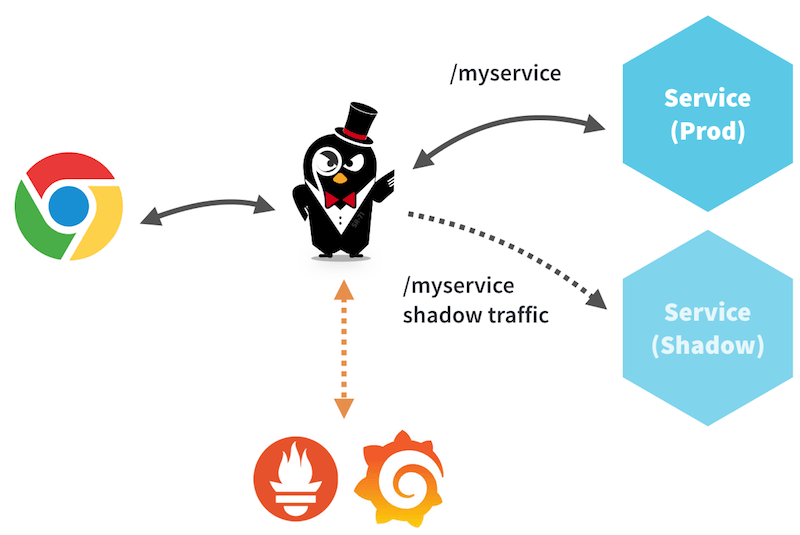

# Ambassador系列-06-金丝雀发布、断路器、CORS和流量镜像

### 金丝雀发布

通过weight权重属性将流量导到不同的上游服务。实现金丝雀发布。weight权重的值介于1-100之间，总的权重为100。

    vi echo-server-v1-service.yaml
    apiVersion: v1
    kind: Service
    metadata:
      labels:
        app: echo-v1
      name: echo-v1
    spec:
      ports:
      - port: 8080
        name: high
        protocol: TCP
        targetPort: 8080
      - port: 80
        name: low
        protocol: TCP
        targetPort: 8080
      selector:
        app: echo-v1
    ---
    apiVersion: apps/v1beta1
    kind: Deployment
    metadata:
      labels:
        app: echo-v1
      name: echo-v1
    spec:
      replicas: 1
      selector:
        matchLabels:
          app: echo-v1
      strategy: {}
      template:
        metadata:
          creationTimestamp: null
          labels:
            app: echo-v1
        spec:
          containers:
          - image: gcr.io/kubernetes-e2e-test-images/echoserver:2.2
            name: echo
            ports:
            - containerPort: 8080
            env:
              - name: NODE_NAME
                valueFrom:
                  fieldRef:
                    fieldPath: spec.nodeName
              - name: POD_NAME
                valueFrom:
                  fieldRef:
                    fieldPath: metadata.name
              - name: POD_NAMESPACE
                valueFrom:
                  fieldRef:
                    fieldPath: metadata.namespace
              - name: POD_IP
                valueFrom:
                  fieldRef:
                    fieldPath: status.podIP
            resources: {}
    
    vi echo-server-v2-service.yaml
    apiVersion: v1
    kind: Service
    metadata:
      labels:
        app: echo-v2
      name: echo-v2
    spec:
      ports:
      - port: 8080
        name: high
        protocol: TCP
        targetPort: 8080
      - port: 80
        name: low
        protocol: TCP
        targetPort: 8080
      selector:
        app: echo-v2
    ---
    apiVersion: apps/v1beta1
    kind: Deployment
    metadata:
      labels:
        app: echo-v2
      name: echo-v2
    spec:
      replicas: 1
      selector:
        matchLabels:
          app: echo-v2
      strategy: {}
      template:
        metadata:
          creationTimestamp: null
          labels:
            app: echo-v2
        spec:
          containers:
          - image: gcr.io/kubernetes-e2e-test-images/echoserver:2.2
            name: echo
            ports:
            - containerPort: 8080
            env:
              - name: NODE_NAME
                valueFrom:
                  fieldRef:
                    fieldPath: spec.nodeName
              - name: POD_NAME
                valueFrom:
                  fieldRef:
                    fieldPath: metadata.name
              - name: POD_NAMESPACE
                valueFrom:
                  fieldRef:
                    fieldPath: metadata.namespace
              - name: POD_IP
                valueFrom:
                  fieldRef:
                    fieldPath: status.podIP
            resources: {}
    
    kubectl apply -f echo-server-v1-service.yaml
    kubectl apply -f echo-server-v2-service.yaml
    
    kubectl get pod,svc
    NAME                             READY   STATUS    RESTARTS   AGE
    pod/ambassador-877b57b69-cvzbl   1/1     Running   2          9d
    pod/ambassador-877b57b69-rtgcq   1/1     Running   2          9d
    pod/echo-v1-77cdb8f7d5-vsj6x     1/1     Running   0          32s
    pod/echo-v2-6659867756-fr8qh     1/1     Running   0          27s
    
    NAME                       TYPE        CLUSTER-IP       EXTERNAL-IP   PORT(S)           AGE
    service/ambassador-admin   NodePort    10.106.34.114    <none>        8877:31207/TCP    9d
    service/ambssador          NodePort    10.98.129.0      <none>        8080:38080/TCP    9d
    service/echo-v1            ClusterIP   10.100.78.40     <none>        8080/TCP,80/TCP   33s
    service/echo-v2            ClusterIP   10.97.72.27      <none>        8080/TCP,80/TCP   27s
    service/kubernetes         ClusterIP   10.96.0.1        <none>        443/TCP           31d

echo-v1的权重为90，echo-v2的权重为10，测试可以发现基本符合。

    vi echo-server-v1v2-mapping.yaml
    ---
    apiVersion: getambassador.io/v1
    kind: Mapping
    metadata:
      name: echo-server-v1-mapping
    spec:
      prefix: /v1v2
      service: echo-v1:8080
      weight: 90
    ---
    apiVersion: getambassador.io/v1
    kind: Mapping
    metadata:
      name: echo-server-v2-mapping
    spec:
      prefix: /v1v2
      service: echo-v2:8080
      weight: 10
    
    curl -i http://192.168.1.50:38080/v1v2 -s | grep "pod IP:"
            pod IP: 10.244.2.8
    curl -i http://192.168.1.50:38080/v1v2 -s | grep "pod IP:"
            pod IP: 10.244.2.8
    curl -i http://192.168.1.50:38080/v1v2 -s | grep "pod IP:"
            pod IP: 10.244.2.8
    curl -i http://192.168.1.50:38080/v1v2 -s | grep "pod IP:"
            pod IP: 10.244.2.8
    curl -i http://192.168.1.50:38080/v1v2 -s | grep "pod IP:"
            pod IP: 10.244.2.8
    curl -i http://192.168.1.50:38080/v1v2 -s | grep "pod IP:"
            pod IP: 10.244.2.8
    curl -i http://192.168.1.50:38080/v1v2 -s | grep "pod IP:"
            pod IP: 10.244.2.8
    curl -i http://192.168.1.50:38080/v1v2 -s | grep "pod IP:"
            pod IP: 10.244.2.8
    curl -i http://192.168.1.50:38080/v1v2 -s | grep "pod IP:"
            pod IP: 10.244.2.8
    curl -i http://192.168.1.50:38080/v1v2 -s | grep "pod IP:"
            pod IP: 10.244.2.8
    curl -i http://192.168.1.50:38080/v1v2 -s | grep "pod IP:"
            pod IP: 10.244.2.8
    curl -i http://192.168.1.50:38080/v1v2 -s | grep "pod IP:"
            pod IP: 10.244.2.8
    curl -i http://192.168.1.50:38080/v1v2 -s | grep "pod IP:"
            pod IP: 10.244.2.8
    curl -i http://192.168.1.50:38080/v1v2 -s | grep "pod IP:"
            pod IP: 10.244.1.11
    curl -i http://192.168.1.50:38080/v1v2 -s | grep "pod IP:"
            pod IP: 10.244.2.8
    curl -i http://192.168.1.50:38080/v1v2 -s | grep "pod IP:"
            pod IP: 10.244.2.8
    curl -i http://192.168.1.50:38080/v1v2 -s | grep "pod IP:"
            pod IP: 10.244.2.8
    curl -i http://192.168.1.50:38080/v1v2 -s | grep "pod IP:"
            pod IP: 10.244.2.8
    curl -i http://192.168.1.50:38080/v1v2 -s | grep "pod IP:"
            pod IP: 10.244.2.8
    curl -i http://192.168.1.50:38080/v1v2 -s | grep "pod IP:"
            pod IP: 10.244.1.11
    curl -i http://192.168.1.50:38080/v1v2 -s | grep "pod IP:"
            pod IP: 10.244.2.8
    curl -i http://192.168.1.50:38080/v1v2 -s | grep "pod IP:"
            pod IP: 10.244.2.8
    curl -i http://192.168.1.50:38080/v1v2 -s | grep "pod IP:"
            pod IP: 10.244.2.8
    curl -i http://192.168.1.50:38080/v1v2 -s | grep "pod IP:"
            pod IP: 10.244.2.8
    curl -i http://192.168.1.50:38080/v1v2 -s | grep "pod IP:"
            pod IP: 10.244.2.8
    curl -i http://192.168.1.50:38080/v1v2 -s | grep "pod IP:"
            pod IP: 10.244.2.8
    curl -i http://192.168.1.50:38080/v1v2 -s | grep "pod IP:"
            pod IP: 10.244.2.8
    curl -i http://192.168.1.50:38080/v1v2 -s | grep "pod IP:"
            pod IP: 10.244.2.8
    curl -i http://192.168.1.50:38080/v1v2 -s | grep "pod IP:"
            pod IP: 10.244.2.8
    curl -i http://192.168.1.50:38080/v1v2 -s | grep "pod IP:"
            pod IP: 10.244.2.8
    curl -i http://192.168.1.50:38080/v1v2 -s | grep "pod IP:"
            pod IP: 10.244.2.8
    curl -i http://192.168.1.50:38080/v1v2 -s | grep "pod IP:"
            pod IP: 10.244.2.8
    curl -i http://192.168.1.50:38080/v1v2 -s | grep "pod IP:"
            pod IP: 10.244.2.8
    curl -i http://192.168.1.50:38080/v1v2 -s | grep "pod IP:"
            pod IP: 10.244.2.8
    curl -i http://192.168.1.50:38080/v1v2 -s | grep "pod IP:"
            pod IP: 10.244.1.11
    curl -i http://192.168.1.50:38080/v1v2 -s | grep "pod IP:"
            pod IP: 10.244.2.8
    curl -i http://192.168.1.50:38080/v1v2 -s | grep "pod IP:"
            pod IP: 10.244.2.8
    curl -i http://192.168.1.50:38080/v1v2 -s | grep "pod IP:"
            pod IP: 10.244.2.8

### 断路器

    circuit_breakers:
    - priority: <string>
      max_connections: <integer>
      max_pending_requests: <integer>
      max_requests: <integer>
      max_retries: <integer>

### CORS跨源资源共享Cross-Origin Resource Sharing

上游服务如果要支持CORS需要进行配置修改，Ambassador支持对CORS请求的拦截和响应，这样上游服务不用再做修改。

    Client              Ambassador      Upstream
      |      OPTIONS       |               |
      | —————————————————> |               |
      |     CORS_RESP      |               |
      | <————————————————— |               | 
      |      GET /foo/     |               |
      | —————————————————> | ————————————> |
      |                    |      RESP     |
      | <————————————————————————————————— |

********************************************************

    ---
    apiVersion: getambassador.io/v1
    kind:  Mapping
    metadata:
      name:  cors
    spec:
      prefix: /cors/
      service: cors-example
      cors:
        origins: http://foo.example,http://bar.example
        methods: POST, GET, OPTIONS
        headers: Content-Type
        credentials: true
        exposed_headers: X-Custom-Header
        max_age: "86400"

### 流量镜像

在测试或者监控场景下，除了部署正常的服务外，再部署一个影子（镜像）服务，对该服务的请求会全部转发到正常服务外，会转发部分镜像流量到影子服务，已达到测试或者监控的目的。

以下会有10%的流量被镜像到影子服务echo-v2:8080上。

    #重新部署service
    kubectl delete -f echo-server-v1-service.yaml
    kubectl delete -f echo-server-v2-service.yaml
    
    kubectl apply -f echo-server-v1-service.yaml
    kubectl apply -f echo-server-v2-service.yaml
    
    vi echo-server-v1v2-mapping.yaml
    ---
    apiVersion: getambassador.io/v1
    kind: Mapping
    metadata:
      name: echo-server-v1-mapping
    spec:
      prefix: /v1v2
      service: echo-v1:8080
    ---
    apiVersion: getambassador.io/v1
    kind: Mapping
    metadata:
      name: echo-server-v2-mapping
    spec:
      prefix: /v1v2
      service: echo-v2:8080
      shadow: true
      weight: 10
    
    kubectl get pod
    NAME                         READY   STATUS    RESTARTS   AGE
    ambassador-877b57b69-cvzbl   1/1     Running   2          9d
    ambassador-877b57b69-rtgcq   1/1     Running   2          9d
    echo-v1-77cdb8f7d5-hgfvl     1/1     Running   0          67s
    echo-v2-6659867756-6n5jg     1/1     Running   0          56s
    
    #查看日志，都没有请求。
    kubectl logs echo-v1-77cdb8f7d5-hgfvl
    kubectl logs echo-v2-6659867756-6n5jg
    
    #多次请求
    curl -i http://192.168.1.50:38080/v1v2 -s | grep "pod IP:"
            pod IP: 10.244.2.9
    curl -i http://192.168.1.50:38080/v1v2 -s | grep "pod IP:"
            pod IP: 10.244.2.9
    curl -i http://192.168.1.50:38080/v1v2 -s | grep "pod IP:"
            pod IP: 10.244.2.9
    curl -i http://192.168.1.50:38080/v1v2 -s | grep "pod IP:"
            pod IP: 10.244.2.9
    curl -i http://192.168.1.50:38080/v1v2 -s | grep "pod IP:"
            pod IP: 10.244.2.9
    curl -i http://192.168.1.50:38080/v1v2 -s | grep "pod IP:"
            pod IP: 10.244.2.9
    curl -i http://192.168.1.50:38080/v1v2 -s | grep "pod IP:"
            pod IP: 10.244.2.9
    curl -i http://192.168.1.50:38080/v1v2 -s | grep "pod IP:"
            pod IP: 10.244.2.9
    curl -i http://192.168.1.50:38080/v1v2 -s | grep "pod IP:"
            pod IP: 10.244.2.9
    curl -i http://192.168.1.50:38080/v1v2 -s | grep "pod IP:"
            pod IP: 10.244.2.9
    curl -i http://192.168.1.50:38080/v1v2 -s | grep "pod IP:"
            pod IP: 10.244.2.9
    curl -i http://192.168.1.50:38080/v1v2 -s | grep "pod IP:"
            pod IP: 10.244.2.9
    curl -i http://192.168.1.50:38080/v1v2 -s | grep "pod IP:"
            pod IP: 10.244.2.9
    curl -i http://192.168.1.50:38080/v1v2 -s | grep "pod IP:"
            pod IP: 10.244.2.9
    curl -i http://192.168.1.50:38080/v1v2 -s | grep "pod IP:"
            pod IP: 10.244.2.9
    curl -i http://192.168.1.50:38080/v1v2 -s | grep "pod IP:"
            pod IP: 10.244.2.9
    curl -i http://192.168.1.50:38080/v1v2 -s | grep "pod IP:"
            pod IP: 10.244.2.9
    curl -i http://192.168.1.50:38080/v1v2 -s | grep "pod IP:"
            pod IP: 10.244.2.9
    curl -i http://192.168.1.50:38080/v1v2 -s | grep "pod IP:"
            pod IP: 10.244.2.9
    curl -i http://192.168.1.50:38080/v1v2 -s | grep "pod IP:"
            pod IP: 10.244.2.9
    curl -i http://192.168.1.50:38080/v1v2 -s | grep "pod IP:"
            pod IP: 10.244.2.9
    curl -i http://192.168.1.50:38080/v1v2 -s | grep "pod IP:"
            pod IP: 10.244.2.9
    curl -i http://192.168.1.50:38080/v1v2 -s | grep "pod IP:"
            pod IP: 10.244.2.9
    curl -i http://192.168.1.50:38080/v1v2 -s | grep "pod IP:"
            pod IP: 10.244.2.9
    curl -i http://192.168.1.50:38080/v1v2 -s | grep "pod IP:"
            pod IP: 10.244.2.9
    
    #查看echo-v1的日志，条数对应。
    kubectl logs echo-v1-77cdb8f7d5-hgfvl
    10.244.2.7 - - [07/Dec/2019:14:41:43 +0000] "GET / HTTP/1.1" 200 718 "-" "curl/7.29.0"
    10.244.1.9 - - [07/Dec/2019:14:41:44 +0000] "GET / HTTP/1.1" 200 718 "-" "curl/7.29.0"
    10.244.1.9 - - [07/Dec/2019:14:41:44 +0000] "GET / HTTP/1.1" 200 718 "-" "curl/7.29.0"
    10.244.1.9 - - [07/Dec/2019:14:41:45 +0000] "GET / HTTP/1.1" 200 718 "-" "curl/7.29.0"
    10.244.1.9 - - [07/Dec/2019:14:41:45 +0000] "GET / HTTP/1.1" 200 718 "-" "curl/7.29.0"
    10.244.2.7 - - [07/Dec/2019:14:41:46 +0000] "GET / HTTP/1.1" 200 718 "-" "curl/7.29.0"
    10.244.2.7 - - [07/Dec/2019:14:41:46 +0000] "GET / HTTP/1.1" 200 718 "-" "curl/7.29.0"
    10.244.2.7 - - [07/Dec/2019:14:41:47 +0000] "GET / HTTP/1.1" 200 718 "-" "curl/7.29.0"
    10.244.1.9 - - [07/Dec/2019:14:41:47 +0000] "GET / HTTP/1.1" 200 718 "-" "curl/7.29.0"
    10.244.2.7 - - [07/Dec/2019:14:41:47 +0000] "GET / HTTP/1.1" 200 718 "-" "curl/7.29.0"
    10.244.2.7 - - [07/Dec/2019:14:41:48 +0000] "GET / HTTP/1.1" 200 718 "-" "curl/7.29.0"
    10.244.1.9 - - [07/Dec/2019:14:41:48 +0000] "GET / HTTP/1.1" 200 718 "-" "curl/7.29.0"
    10.244.1.9 - - [07/Dec/2019:14:41:49 +0000] "GET / HTTP/1.1" 200 718 "-" "curl/7.29.0"
    10.244.2.7 - - [07/Dec/2019:14:41:49 +0000] "GET / HTTP/1.1" 200 718 "-" "curl/7.29.0"
    10.244.2.7 - - [07/Dec/2019:14:41:49 +0000] "GET / HTTP/1.1" 200 718 "-" "curl/7.29.0"
    10.244.1.9 - - [07/Dec/2019:14:41:50 +0000] "GET / HTTP/1.1" 200 718 "-" "curl/7.29.0"
    10.244.2.7 - - [07/Dec/2019:14:41:50 +0000] "GET / HTTP/1.1" 200 718 "-" "curl/7.29.0"
    10.244.2.7 - - [07/Dec/2019:14:41:51 +0000] "GET / HTTP/1.1" 200 718 "-" "curl/7.29.0"
    10.244.1.9 - - [07/Dec/2019:14:41:51 +0000] "GET / HTTP/1.1" 200 718 "-" "curl/7.29.0"
    10.244.2.7 - - [07/Dec/2019:14:41:52 +0000] "GET / HTTP/1.1" 200 718 "-" "curl/7.29.0"
    10.244.2.7 - - [07/Dec/2019:14:41:52 +0000] "GET / HTTP/1.1" 200 718 "-" "curl/7.29.0"
    10.244.1.9 - - [07/Dec/2019:14:41:54 +0000] "GET / HTTP/1.1" 200 718 "-" "curl/7.29.0"
    10.244.1.9 - - [07/Dec/2019:14:41:56 +0000] "GET / HTTP/1.1" 200 718 "-" "curl/7.29.0"
    10.244.1.9 - - [07/Dec/2019:14:41:56 +0000] "GET / HTTP/1.1" 200 718 "-" "curl/7.29.0"
    10.244.2.7 - - [07/Dec/2019:14:41:56 +0000] "GET / HTTP/1.1" 200 718 "-" "curl/7.29.0"
    
    #服务echo-v2的请求条数为3，和10%的比例基本上一致。
    kubectl logs echo-v2-6659867756-6n5jg
    10.244.2.7 - - [07/Dec/2019:14:41:46 +0000] "GET / HTTP/1.1" 200 744 "-" "curl/7.29.0"
    10.244.1.9 - - [07/Dec/2019:14:41:54 +0000] "GET / HTTP/1.1" 200 744 "-" "curl/7.29.0"
    10.244.2.7 - - [07/Dec/2019:14:41:56 +0000] "GET / HTTP/1.1" 200 744 "-" "curl/7.29.0"

## Ambassador系列文章

[Ambassador系列-01-介绍、安装和使用](01-installation-introduction.md)

[Ambassador系列-02-Module模块](02-module.md)

[Ambassador系列-03-服务配置和服务发现](03-service-configuration-discovery.md)

[Ambassador系列-04-服务配置Mapping](04-service-mapping.md)

[Ambassador系列-05-负载均衡](05-load-balance.md) 

[Ambassador系列-06-金丝雀发布、断路器、CORS和流量镜像](06-other-feature.md)

[Ambassador系列-07-TCP映射TCPMapping](07-tcpmapping.md)

[Ambassador系列-08-TLS配置-HTTPS重定向和TLS终结](08-tlscontext.md)

[Ambassador系列-09-AuthService认证服务](09-authservice.md)

[Ambassador系列-10-RateLimitService限速服务](10-ratelimitservice.md)

[Ambassador系列-11-Helm安装Ambassador Edge Stack 1.1.0](11-ambassador-edge-stack-helm-installation.md)