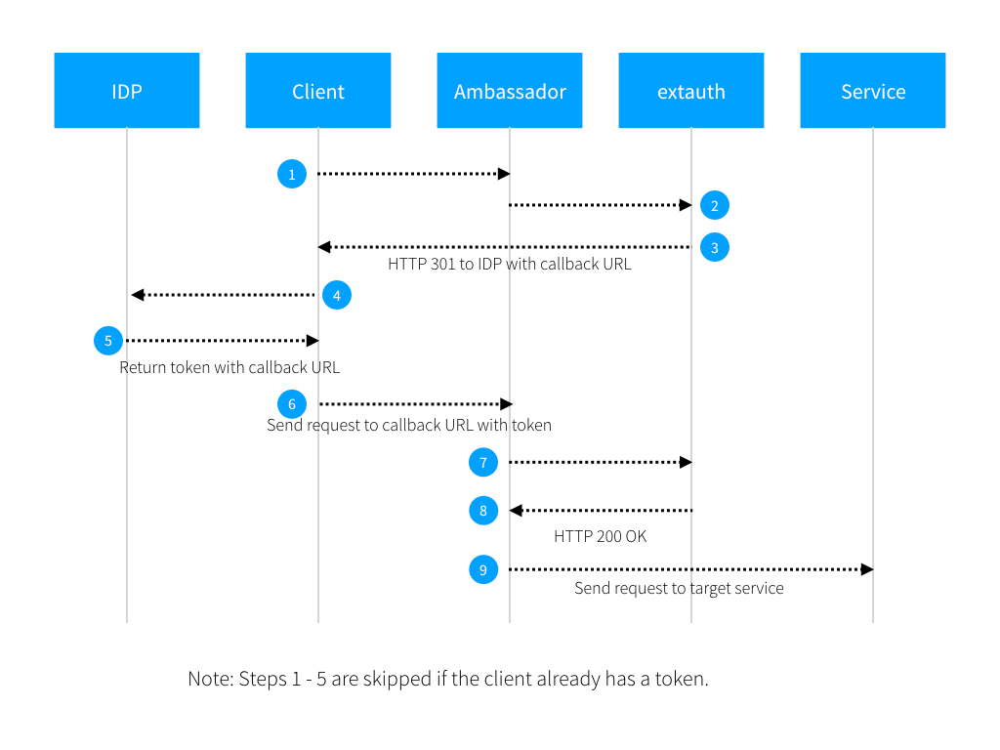

# Ambassador系列-09-AuthService认证服务

Authservice使用外部服务来实现身份验证和授权。简单来说，Client向Ambassador网关发送的请求，都会被Ambassador拦截，Ambassador会将拦截的请求报文体去除，只将报文头转发给外部认证服务，外部认证服务会进行身份验证或者校验token，如果合法将返回http状态码200，否则返回非200状态码。详细流程如下：

- AuthService是第一个调用的外部服务。Ambassador将http method和header都转发给AuthService服务，只做两个缺省变更：
	- Content-Length请求头被置为0.
	- 请求体body被移除。
- 当返回HTTP状态码200时，表示认证或者校验成功，允许继续向上游服务请求，其它所有的状态码都将阻止请求继续进行，直接返回给客户端。
- bypass_auth：在Mapping中配置属性bypass_auth为true，禁用该mapping的身份验证。
- proto：外部认证服务支持的协议类型，包括http和grpc，缺省为http。
- include_body：是否包含报文体，缺省报文体会被去除。
	- max_bytes：传递给AuthService的报文体body的最大字节数。
	- allow_partial：如果为true，第一个最大字节数会被发送给AuthService，否则请求将被拒绝。
- status_on_error：如果AuthService无法响应时返回的状态码，缺省为403。
- failure_node_allow：如果AuthService失败时，请求是否允许转到上游服务，缺省为false。
- 支持配置多个AuthService。

下面举一例子。作者开发了一个简单的SpringBoot应用，该应用在拦截器中接受username和password两个参数，如果username=admin并且password=123时，返回http状态码200，否则返回状态码403。此服务作为外部认证服务。该服务已经放到hub.docker.io中，存储库为twingao/auth-server:1.0.0。

    public boolean preHandle(HttpServletRequest request, HttpServletResponse response, Object handler) throws Exception {
        
        #接受两个参数
        String username = (String)request.getParameter("username");
        String password = (String)request.getParameter("password");
    	
        #如果username = admin并且password = 123时，返回SC_OK，即http状态码200.
        if (username != null && password != null) {
            if (username.equals("admin") && password.equals("123")) {
                response.reset();
                response.setStatus(HttpServletResponse.SC_OK);
    	
                PrintWriter pw = response.getWriter();
                pw.flush();
                pw.close();
    			
                return false;
            }
        }
    	
        #否则，返回SC_FORBIDDEN，即http状态码403.
        response.reset();
        response.setStatus(HttpServletResponse.SC_FORBIDDEN);
        response.setCharacterEncoding("UTF-8");
        response.setContentType("applcation/json;chartset=UTF-8");

        PrintWriter pw = response.getWriter();
		
        pw.write(JSONObject.toJSONString(new JsonResult(ResultCode.NOT_LOGIN, "forbidden", "auth failure.")));
        pw.flush();
        pw.close();
    	
        return false;
    }

先将SpringBoot应用部署到Kubernetes。

	vi auth-server-service.yaml
	apiVersion: v1
	kind: Service
	metadata:
	  name: auth-service
	  labels: 
	    name: auth-service
	spec:
	  type: NodePort
	  ports:
	  - port: 80
	    name: http
	    protocol: TCP
	    targetPort: 8080
	    nodePort: 38080
	  selector:
	    name: auth-server
	---
	apiVersion: apps/v1
	kind: Deployment
	metadata:
	  name: auth-server
	spec:
	  replicas: 1
	  selector:
	    matchLabels:
	      name: auth-server
	  template:
	    metadata:
	      labels: 
	        name: auth-server
	    spec:
	      containers:
	        - name: auth-server
	          image: twingao/auth-server:1.0.0
	          imagePullPolicy: IfNotPresent
	          ports:
	          - containerPort: 8080
	
	kubectl apply -f auth-server-service.yaml

将auth-service设置为外部认证服务AuthService。

	vi auth-server-authservice.yaml
	---
	apiVersion: getambassador.io/v1
	kind: AuthService
	metadata:
	  name: auth-server-authservice
	spec:
	  auth_service: auth-service:80
	
	kubectl apply -f auth-server-authservice.yaml

假设echo服务已经被部署，否则请参考[Ambassador系列-01-介绍、安装和使用](01-installation-introduction.md)。现在继续访问echo服务。

	#没有携带username和password参数，禁止访问
	curl -i "http://192.168.1.50/foo"
	HTTP/1.1 403 Forbidden
	content-length: 69
	content-type: text/plain
	lua-scripts-enabled: Processed
	date: Sat, 14 Dec 2019 04:17:28 GMT
	server: envoy
	
	{"code":"600","count":0,"data":"auth failure.","message":"forbidden"}
	
	#携带正确的username和password参数，允许访问
	curl -i "http://192.168.1.50/foo/?username=admin&password=123"
	HTTP/1.1 200 OK
	date: Sat, 14 Dec 2019 04:22:32 GMT
	content-type: text/plain
	server: envoy
	x-envoy-upstream-service-time: 12
	lua-scripts-enabled: Processed
	transfer-encoding: chunked
	
	
	Hostname: echo-768f499dc8-f64b2
	
	Pod Information:
	        node name:      k8s-node2
	        pod name:       echo-768f499dc8-f64b2
	        pod namespace:  default
	        pod IP: 10.244.2.41
	
	Server values:
	        server_version=nginx: 1.14.2 - lua: 10015
	
	Request Information:
	        client_address=10.244.1.35
	        method=GET
	        real path=//?username=admin&amp;password=123
	        query=username=admin&amp;password=123
	        request_version=1.1
	        request_scheme=http
	        request_uri=http://192.168.1.50:8080//?username=admin&amp;password=123
	
	Request Headers:
	        accept=*/*
	        content-length=0
	        host=192.168.1.50
	        user-agent=curl/7.29.0
	        x-envoy-expected-rq-timeout-ms=3000
	        x-envoy-internal=true
	        x-envoy-original-path=/foo/?username=admin&amp;password=123
	        x-forwarded-for=10.244.0.0
	        x-forwarded-proto=http
	        x-request-id=5ee72824-4b25-4635-bba9-22cfa87f9d5c
	
	Request Body:
	        -no body in request-
	
	#携带的username和password参数，但password值错误，禁止访问
	curl -i "http://192.168.1.50/foo?username=admin&password=1231"
	HTTP/1.1 403 Forbidden
	content-length: 69
	content-type: text/plain
	lua-scripts-enabled: Processed
	date: Sat, 14 Dec 2019 04:24:03 GMT
	server: envoy
	
	{"code":"600","count":0,"data":"auth failure.","message":"forbidden"}

## Ambassador系列文章

[Ambassador系列-01-介绍、安装和使用](01-installation-introduction.md)

[Ambassador系列-02-Module模块](02-module.md)

[Ambassador系列-03-服务配置和服务发现](03-service-configuration-discovery.md)

[Ambassador系列-04-服务配置Mapping](04-service-mapping.md)

[Ambassador系列-05-负载均衡](05-load-balance.md) 

[Ambassador系列-06-金丝雀发布、断路器、CORS和流量镜像](06-other-feature.md)

[Ambassador系列-07-TCP映射TCPMapping](07-tcpmapping.md)

[Ambassador系列-08-TLS配置-HTTPS重定向和TLS终结](08-tlscontext.md)

[Ambassador系列-09-AuthService认证服务](09-authservice.md)

[Ambassador系列-10-RateLimitService限速服务](10-ratelimitservice.md)

[Ambassador系列-11-Helm安装Ambassador Edge Stack 1.1.0](11-ambassador-edge-stack-helm-installation.md)