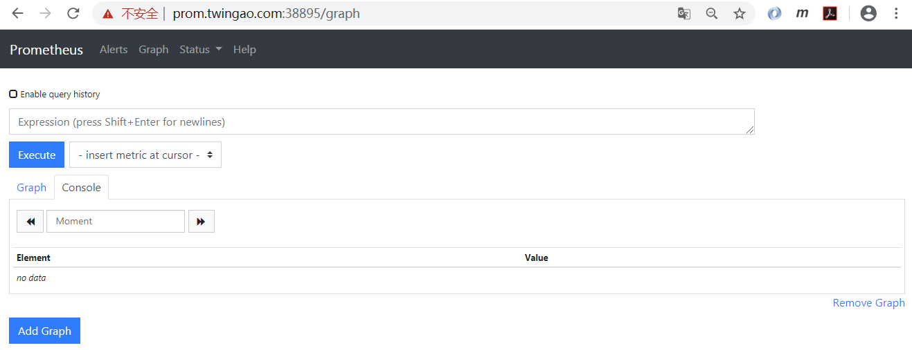
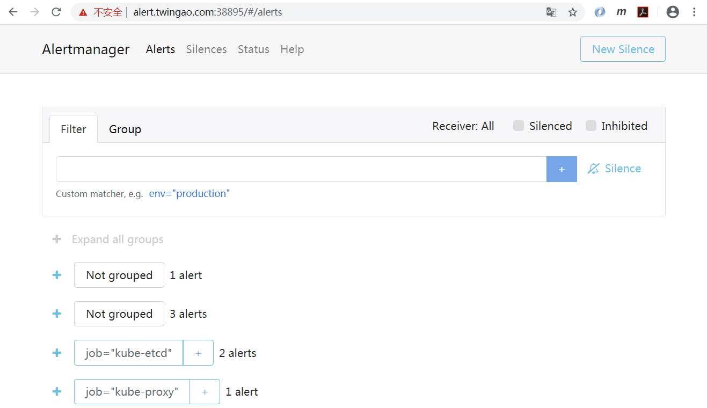
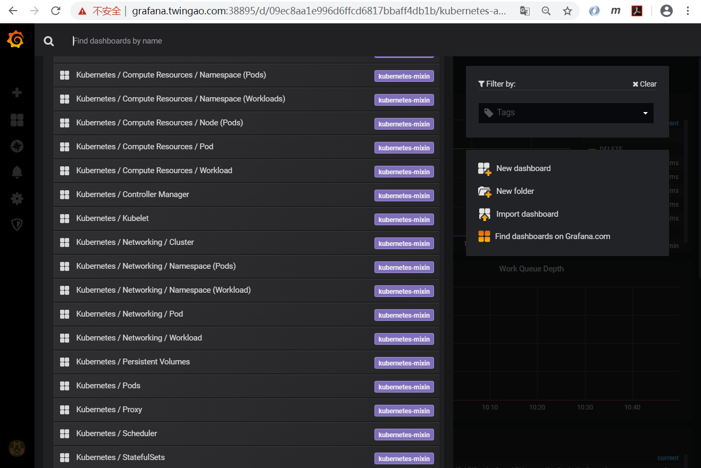
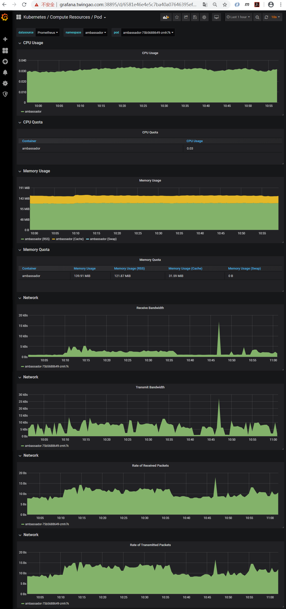
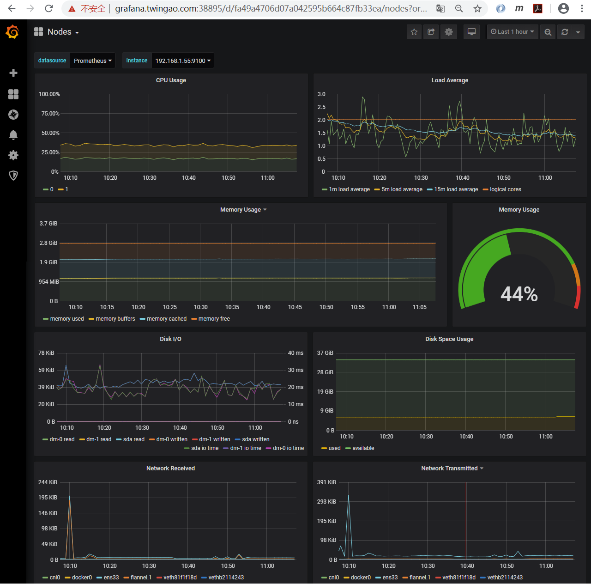
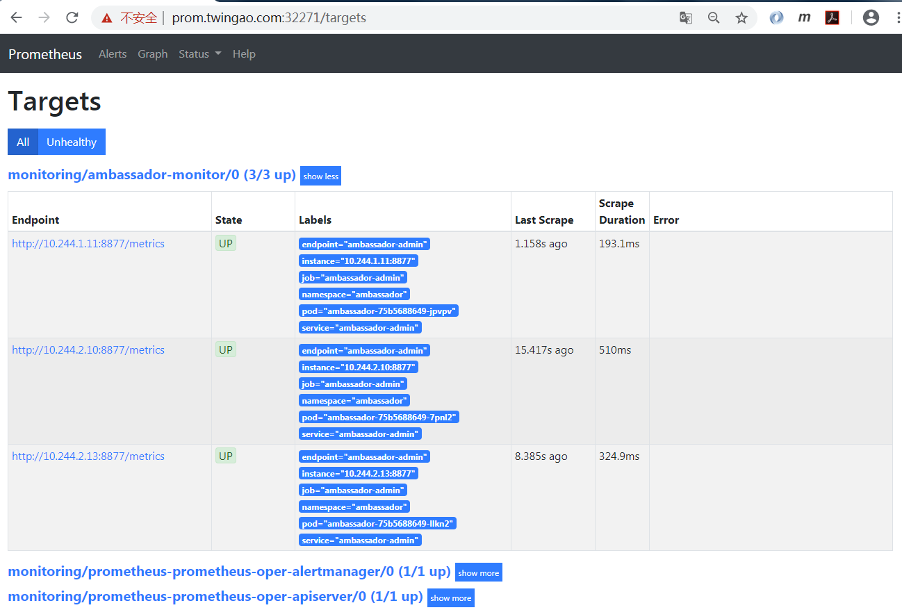
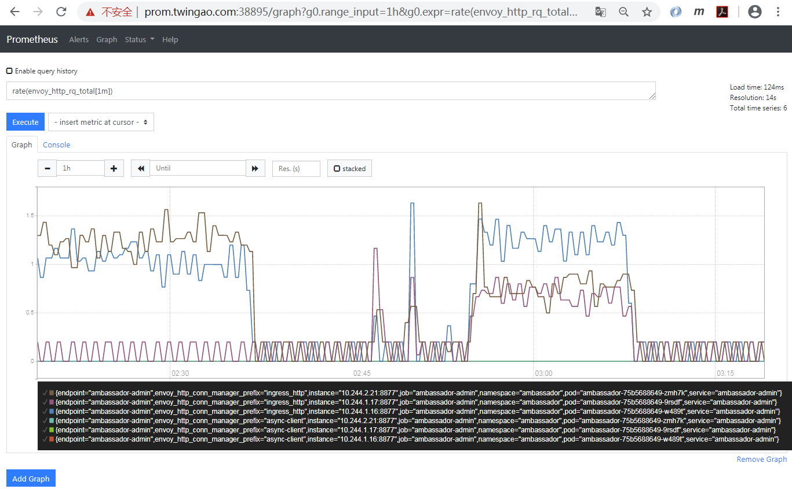
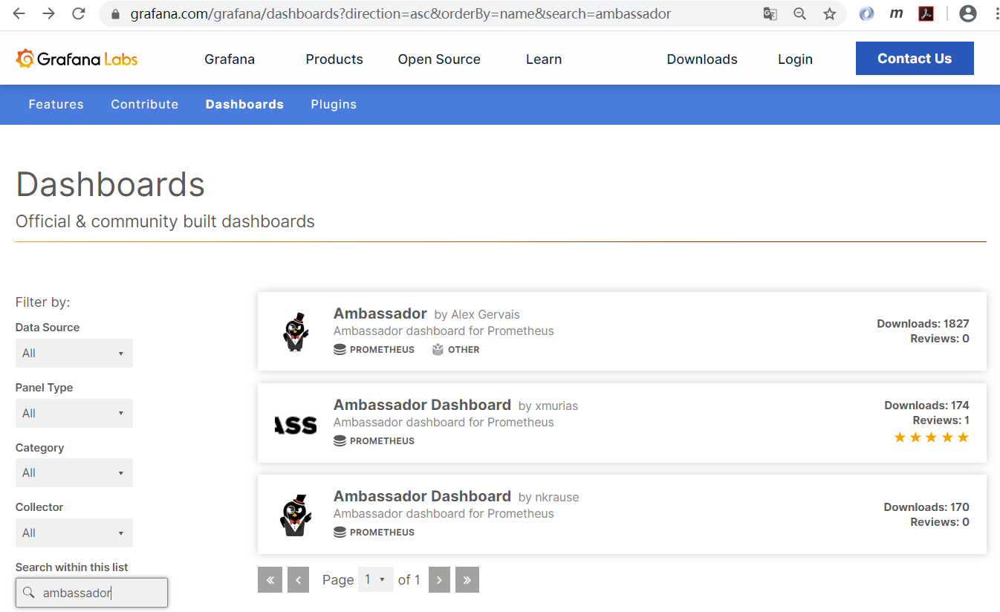
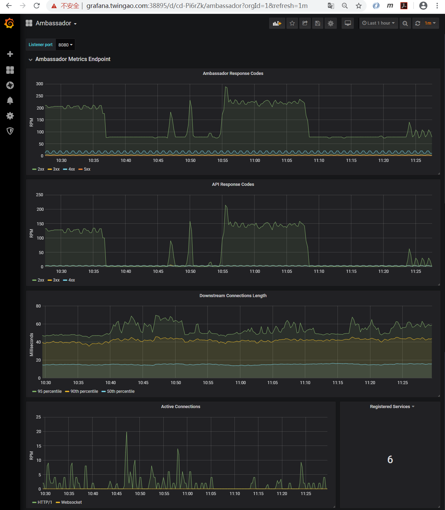
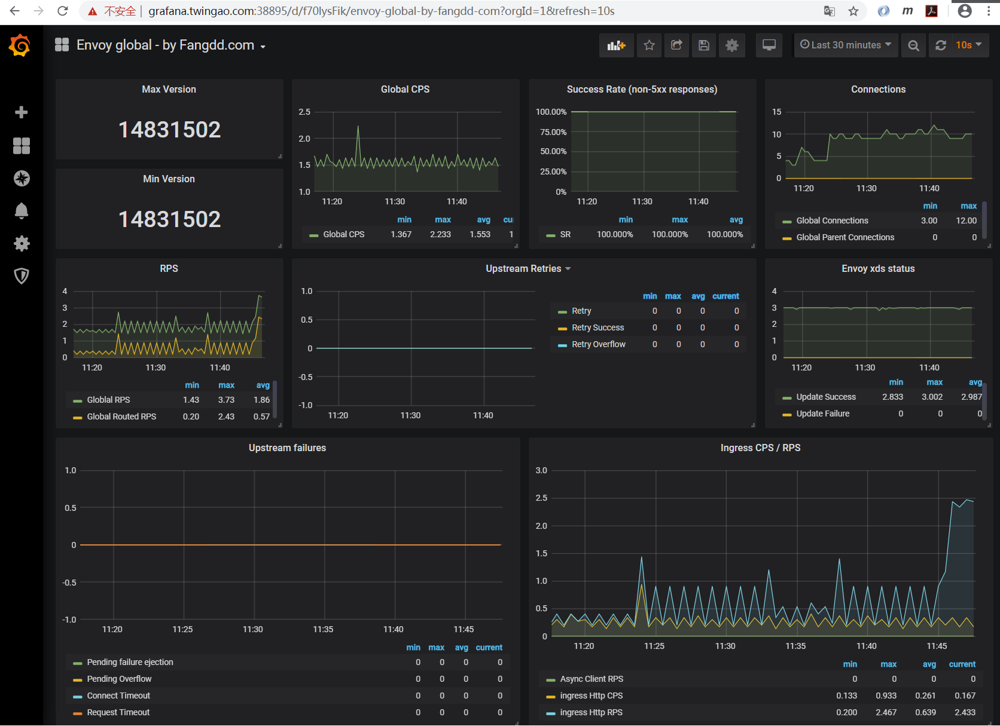

# Ambassador系列-12-Prometheus Operator监控Ambassador Edge Stack

Prometheus Operatorde的安装部署见[Helm部署Prometheus Operator和自定义监控](../prometheus/helm-prometheus-operator.md)。

Ambassador Edge Stack的安装部署见[Ambassador系列-11-Helm安装Ambassador Edge Stack 1.1.0](11-ambassador-edge-stack-helm-installation.md)。

Ambassador安装后的的概况。

    kubectl get all -nambassador
    NAME                                    READY   STATUS    RESTARTS   AGE
    pod/ambassador-75b5688649-9rsdf         1/1     Running   2          13h
    pod/ambassador-75b5688649-w489t         1/1     Running   2          13h
    pod/ambassador-75b5688649-zmh7k         1/1     Running   2          13h
    pod/ambassador-redis-8556cbb4c6-7kqsg   1/1     Running   0          13h
    
    NAME                       TYPE        CLUSTER-IP     EXTERNAL-IP   PORT(S)                      AGE
    service/ambassador         NodePort    10.1.165.172   <none>        80:17555/TCP,443:38895/TCP   13h
    service/ambassador-admin   ClusterIP   10.1.104.26    <none>        8877/TCP                     13h
    service/ambassador-redis   ClusterIP   10.1.46.44     <none>        6379/TCP                     13h
    
    NAME                               READY   UP-TO-DATE   AVAILABLE   AGE
    deployment.apps/ambassador         3/3     3            3           13h
    deployment.apps/ambassador-redis   1/1     1            1           13h
    
    NAME                                          DESIRED   CURRENT   READY   AGE
    replicaset.apps/ambassador-75b5688649         3         3         3       13h
    replicaset.apps/ambassador-redis-8556cbb4c6   1         1         1       13h

通过管理Service端口访问metrics。

    curl http://10.1.166.205:8877/metrics
    # TYPE envoy_cluster_upstream_cx_connect_timeout counter
    envoy_cluster_upstream_cx_connect_timeout{envoy_cluster_name="cluster_127_0_0_1_8877_ambassador"} 0
    # TYPE envoy_cluster_upstream_flow_control_paused_reading_total counter
    envoy_cluster_upstream_flow_control_paused_reading_total{envoy_cluster_name="cluster_127_0_0_1_8877_ambassador"} 0
    # TYPE envoy_cluster_upstream_cx_close_notify counter
    envoy_cluster_upstream_cx_close_notify{envoy_cluster_name="cluster_127_0_0_1_8877_ambassador"} 0
    # TYPE envoy_cluster_lb_recalculate_zone_structures counter
    envoy_cluster_lb_recalculate_zone_structures{envoy_cluster_name="cluster_127_0_0_1_8877_ambassador"} 0
    # TYPE envoy_cluster_upstream_flow_control_resumed_reading_total counter
    envoy_cluster_upstream_flow_control_resumed_reading_total{envoy_cluster_name="cluster_127_0_0_1_8877_ambassador"} 0
    # TYPE envoy_cluster_upstream_rq_timeout counter
    envoy_cluster_upstream_rq_timeout{envoy_cluster_name="cluster_127_0_0_1_8877_ambassador"} 0
    # TYPE envoy_cluster_upstream_cx_connect_fail counter
    envoy_cluster_upstream_cx_connect_fail{envoy_cluster_name="cluster_127_0_0_1_8877_ambassador"} 0
    # TYPE envoy_cluster_upstream_rq_cancelled counter
    envoy_cluster_upstream_rq_cancelled{envoy_cluster_name="cluster_127_0_0_1_8877_ambassador"} 0
    # TYPE envoy_cluster_upstream_cx_rx_bytes_total counter
    envoy_cluster_upstream_cx_rx_bytes_total{envoy_cluster_name="cluster_127_0_0_1_8877_ambassador"} 0
    # TYPE envoy_cluster_upstream_cx_overflow counter
    envoy_cluster_upstream_cx_overflow{envoy_cluster_name="cluster_127_0_0_1_8877_ambassador"} 0
    # TYPE envoy_cluster_upstream_cx_destroy_remote counter
    envoy_cluster_upstream_cx_destroy_remote{envoy_cluster_name="cluster_127_0_0_1_8877_ambassador"} 0
    # TYPE envoy_cluster_upstream_cx_http2_total counter
    envoy_cluster_upstream_cx_http2_total{envoy_cluster_name="cluster_127_0_0_1_8877_ambassador"} 0
    ......

为Prometheus、Grafana和Alertmanager配置Mapping。

    vi prometheus-mapping.yaml
    ---
    apiVersion: getambassador.io/v2
    kind: Mapping
    metadata:
      name: prometheus-mapping
      namespace: ambassador
    spec:
      host: prom.twingao.com:38895
      prefix: /
      service: prometheus-prometheus-oper-prometheus.monitoring:9090
    ---
    apiVersion: getambassador.io/v2
    kind: Mapping
    metadata:
      name: grafana-mapping
      namespace: ambassador
    spec:
      host: grafana.twingao.com:38895
      prefix: /
      service: prometheus-grafana.monitoring:80
    ---
    apiVersion: getambassador.io/v2
    kind: Mapping
    metadata:
      name: alert-mapping
      namespace: ambassador
    spec:
      host: alert.twingao.com:38895
      prefix: /
      service: prometheus-prometheus-oper-alertmanager.monitoring:9093
    
    kubectl apply -f prometheus-mapping.yaml

在浏览器主机增加hosts，Windows系统在`C:\Windows\System32\drivers\etc\hosts`。

    # Prometheus Start
    192.168.1.55 prom.twingao.com
    192.168.1.55 grafana.twingao.com
    192.168.1.55 alert.twingao.com
    # Prometheus End

访问Prometheus，地址[https://prom.twingao.com:38895/graph](https://prom.twingao.com:38895/graph)。

访问Alertmanager，地址：[https://alert.twingao.com:38895/#/alerts](https://alert.twingao.com:38895/#/alerts)。

访问Grafana，地址[https://grafana.twingao.com:38895/](https://grafana.twingao.com:38895/)，缺省密码为`prom-operator`，获取方式：

    helm show values stable/prometheus-operator | grep adminPassword
      adminPassword: prom-operator

Grafana缺省内置了多个dashboard。

Grafana能够自动探测到Pod，并对Pod从CPU、内存、网络多个方面进行监控。

Grafana能够对Kubernetes的各个Node节点从CPU、内存、负载、磁盘I/O、磁盘使用率和网络多个方面进行监控。

我们从service/ambassador-admin抓取metrics，查看一下ports。

    kubectl get service/ambassador-admin -oyaml -nambassador
    apiVersion: v1
    kind: Service
    metadata:
      creationTimestamp: "2020-04-01T13:34:28Z"
      labels:
        app.kubernetes.io/instance: ambassador
        app.kubernetes.io/managed-by: Helm
        app.kubernetes.io/name: ambassador
        app.kubernetes.io/part-of: ambassador
        helm.sh/chart: ambassador-6.2.2
        product: aes
        service: ambassador-admin
      name: ambassador-admin
      namespace: ambassador
      resourceVersion: "74460"
      selfLink: /api/v1/namespaces/ambassador/services/ambassador-admin
      uid: 85a6c036-0e5e-4abb-bfd8-70c8956d305e
    spec:
      clusterIP: 10.1.104.26
      ports:
      - name: ambassador-admin
        port: 8877
        protocol: TCP
        targetPort: admin
      selector:
        app.kubernetes.io/instance: ambassador
        app.kubernetes.io/name: ambassador
      sessionAffinity: None
      type: ClusterIP
    status:
      loadBalancer: {}

查看Prometheus自定义资源，其中定义了`serviceMonitorSelector.matchLabels=release: prometheus`，Prometheus据此关联ServiceMonitor。

    kubectl get prometheuses.monitoring.coreos.com/prometheus-prometheus-oper-prometheus -nmonitoring -oyaml
    apiVersion: monitoring.coreos.com/v1
    kind: Prometheus
    metadata:
      creationTimestamp: "2020-04-01T01:43:35Z"
      generation: 1
      labels:
        app: prometheus-operator-prometheus
        chart: prometheus-operator-8.5.0
        heritage: Helm
        release: prometheus
      name: prometheus-prometheus-oper-prometheus
      namespace: monitoring
      resourceVersion: "14492"
      selfLink: /apis/monitoring.coreos.com/v1/namespaces/monitoring/prometheuses/prometheus-prometheus-oper-prometheus
      uid: 2b97c71a-5ec6-41bf-a42a-565136821ae5
    spec:
      alerting:
        alertmanagers:
        - name: prometheus-prometheus-oper-alertmanager
          namespace: monitoring
          pathPrefix: /
          port: web
      baseImage: quay.io/prometheus/prometheus
      enableAdminAPI: false
      externalUrl: http://prometheus-prometheus-oper-prometheus.monitoring:9090
      listenLocal: false
      logFormat: logfmt
      logLevel: info
      paused: false
      podMonitorNamespaceSelector: {}
      podMonitorSelector:
        matchLabels:
          release: prometheus
      portName: web
      replicas: 1
      retention: 10d
      routePrefix: /
      ruleNamespaceSelector: {}
      ruleSelector:
        matchLabels:
          app: prometheus-operator
          release: prometheus
      securityContext:
        fsGroup: 2000
        runAsNonRoot: true
        runAsUser: 1000
      serviceAccountName: prometheus-prometheus-oper-prometheus
      serviceMonitorNamespaceSelector: {}
      serviceMonitorSelector:
        matchLabels:
          release: prometheus
      version: v2.13.1

创建ServiceMonitor。其中几个需要注意的关键点。
- ServiceMonitor的name最终会反应到Prometheus的配置中，作为job_name。
- 由于Prometheus自定义资源中定义了`serviceMonitorSelector.matchLabels=release: prometheus`，表示ServiceMonitor需要定义一个标签release: prometheus，Prometheus据此可以关联ServiceMonitor。
- ServiceMonitor的命名空间必须和Prometheus所在的命名空间相同，此处为monitoring。
- endpoints.port需要和Service中的拉取metrics的ports.name对应，此处和上面对应为ambassador-admin。
- namespaceSelector.matchNames需要和被监控的Service所在的命名空间相同，此处为ambassador。
- selector.matchLabels的标签必须和被监控的Service中能唯一标明身份的标签对应。

创建ambassador-admin服务对应的ServiceMonitor。

    vi prometheus-serviceMonitorAmbassador.yaml
    ---
    apiVersion: monitoring.coreos.com/v1
    kind: ServiceMonitor
    metadata:
      name: ambassador-monitor
      labels:
        release: prometheus
      namespace: monitoring
    spec:
      endpoints:
      - port: ambassador-admin
      namespaceSelector:
        matchNames:
        - ambassador
      selector:
        matchLabels:
          service: ambassador-admin

    kubectl apply -f prometheus-serviceMonitorAmbassador.yaml

Prometheus的Targets。

Prometheus监控指标每分钟的请求数`rate(envoy_http_rq_total[1m])`。

可以从Grafana的Dashboard模板[https://grafana.com/grafana/dashboards](https://grafana.com/grafana/dashboards)中下载Ambassador相关Dashboard。可以下载第一个模板。

在Grafana将该Dashboard上传上去，能够从多个方面监控。

由于Ambassador是基于envoy开发的，其metrics也是从envoy直接拉取的。我们也可以使用envoy的Dashboard。我们可以参考这些Dashboard模板，然后结合metrics，开发适合自己的Dashboard。

